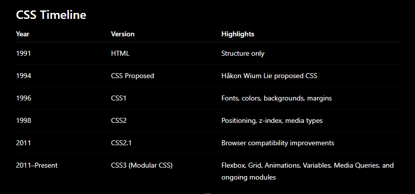

> In 1994, Håkon Wium Lie proposed CSS (Cascading Style Sheets).

# What is a CSS?

**Ans:** Css stands for cascading style sheet . It is a stylesheet language that describes presentation and visual appearance of html or xml document. It tells the browser how the element should look like inlcuding their font , colours, spacing , background etc;

### characterics of CSS
1. **Declarative Language:** we just need to define what to do . we do not tell browser how to do it.
2. **Stylesheet Language:** it defines the presentation and separate the content;
3. **Rule-Based:** styles are written as selector and declaration

# Why CSS is called Cascading ?
**Ans:** css is called cascading because when multiple css rules are apllied on single html element than browser use cascade-set of rules basend on origin , importance , specificity  and source order to decide which style takes precedence.

#  Why was CSS created?

**Answer:**CSS was created to separate the presentation of a webpage from its content. Before CSS, developers used HTML presentation tags like  and 
, making webpages difficult to maintain and scale. CSS introduced reusable styles, cleaner HTML, consistent design, and easier maintenance.

# 3. What is Separation of Concerns?

It is the principle of dividing a webpage into different responsibilities:

**HTML** → Structure
**CSS** → Presentation
**JavaScript** → Behavior

This makes applications easier to develop, test, maintain, and scale.

# CSS history ?

# Browser Rendering pipeline ?
**Ans:** The Browser Rendering Pipeline is the process by which a web browser parses HTML, CSS, executes JavaScript, constructs internal data structures, calculates the layout of elements, paints pixels, and displays the final webpage on the screen.

### High level Pipeline
        User enters URL
               │
               ▼
      Browser requests page
               │
               ▼
      HTML is downloaded
               │
               ▼
        HTML Parser
               │
               ▼
           DOM Tree
               │
               ├──────────────┐
               │              │
               ▼              ▼
      CSS downloaded     JavaScript
               │              │
               ▼              │
         CSS Parser           │
               │              │
               ▼              │
            CSSOM             │
               │              │
               └──────┬───────┘
                      ▼
                Render Tree
                      │
                      ▼
          Layout (Reflow)
                      │
                      ▼
             Paint (Repaint)
                      │
                      ▼
           Compositing
                      │
                      ▼
        Pixels on the Screen

  ### . What are the major stages of rendering?
1. HTML Parsing → DOM
2. CSS Parsing → CSSOM
3. JavaScript Execution
4. Render Tree Construction
5. Layout (Reflow)
6. Paint (Repaint)
7. Compositing

### Why does the browser need both the DOM and CSSOM?
The DOM provides the document structure, while the CSSOM provides styling information. The browser combines them to create the Render Tree, which contains only visible elements and their computed styles.

### What is the difference between Layout and Paint?
Layout (Reflow): Calculates the size and position of visible elements.
Paint (Repaint): Draws the visual appearance of those elements (text, colors, borders, backgrounds,) etc.

# what is css parsor?
A CSS Parser is a browser component that reads CSS code, validates its syntax, interprets the rules, and builds the internal data structure CSS Object Model (CSSOM), which the browser later uses to style HTML elements.

# What is Render Tree ?
Render tree is a tree like data structure created by combining dom and cssom . It contain the visible element and computed style which used by browser to calculate the layout and pain the element on screen.